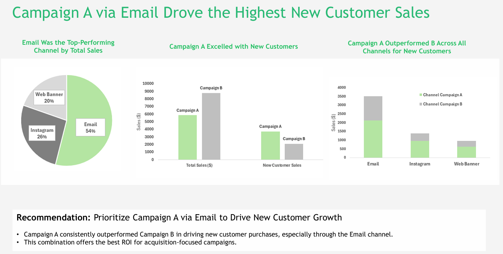
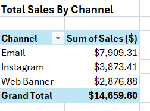
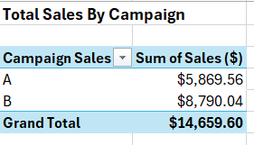
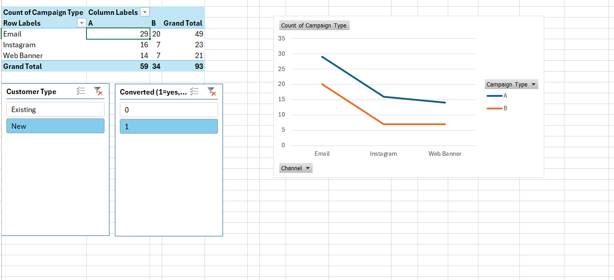
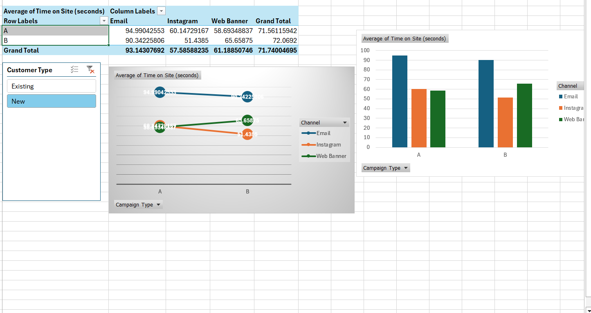
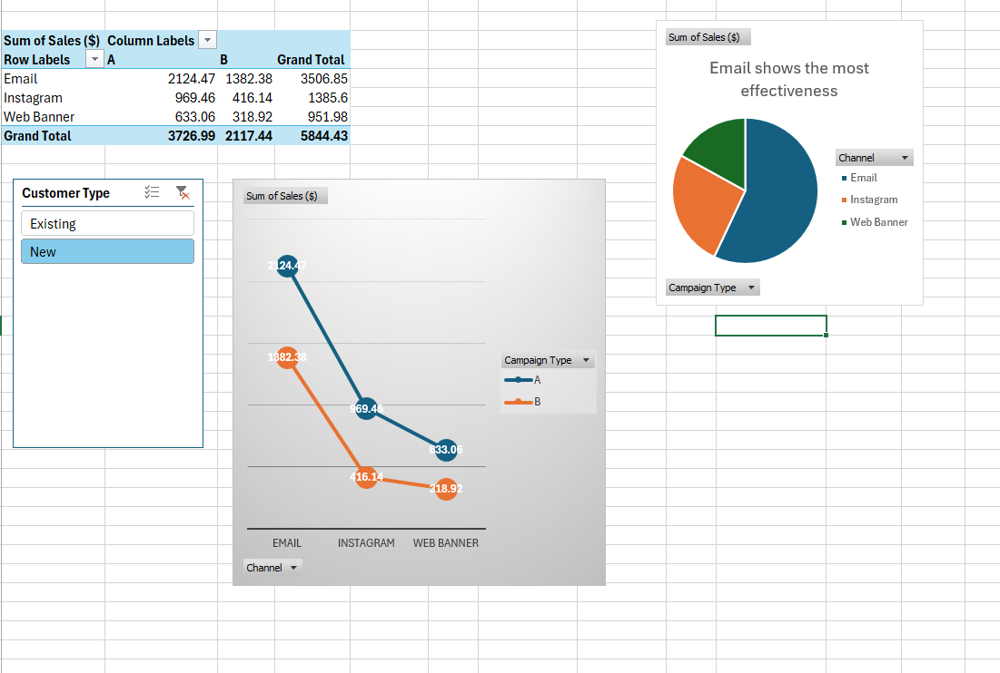

# 📊 Marketing Campaign Analysis Dashboard

A data analytics project focused on identifying the most effective marketing campaign and marketing channel for acquiring new customers using Microsoft Excel.

---

## 📌 Project Overview

This project analyzes marketing campaign performance across multiple digital channels to identify which campaign generates the highest customer acquisition, sales, and user engagement. The analysis includes campaign comparison, customer segmentation, channel performance, and actionable business recommendations presented through an executive dashboard.

---

## 🎯 Business Objective

The goal of this project is to answer the following business questions:

- Which marketing campaign performs the best?
- Which marketing channel generates the highest sales?
- Which campaign is most effective at acquiring new customers?
- Where should the marketing budget be invested to maximize ROI?

---

## 🛠️ Tools Used

- Microsoft Excel
- Pivot Tables
- Pivot Charts
- PowerPoint
- Microsoft Word

---

## 📂 Project Files

```
📁 Marketing Campaign Analysis
│
├── Campaign_Data.xlsx              # Raw dataset
├── Data_Slide.pptx  # Stakeholder Recommendation
├── campaign recommendation email.docx
└── Choosing Chart Types.docx
```

---

## 📊 Analysis Performed

### 1. Sales Analysis
- Compared Campaign A and Campaign B
- Evaluated sales across Email, Instagram, and Web Banner channels

### 2. Customer Segmentation
- New Customers
- Existing Customers

### 3. Channel Performance
- Total Sales
- User Engagement
- Conversion Performance

### 4. Business Recommendation
Identified the best campaign and marketing channel for customer acquisition.

---

## 📈 Dashboard Highlights

- Total Sales by Channel
- Campaign Comparison
- New vs Existing Customer Sales
- User Engagement Analysis
- Marketing Recommendation

---

## 🔍 Key Insights

### 🏆 Best Marketing Channel
**Email**

Reasons:
- Highest total sales
- Highest customer engagement
- Best conversion rate

---

### 🏆 Best Campaign
**Campaign A**

Campaign A consistently outperformed Campaign B in:
- New customer acquisition
- Email marketing performance
- Overall customer engagement

Although Campaign B generated higher overall revenue, Campaign A proved to be significantly more effective in acquiring new customers.

---

## 💡 Business Recommendation

### Recommended Strategy

**Campaign A + Email Channel**

This combination demonstrated:

- Highest new customer sales
- Strong customer engagement
- Better conversion efficiency
- Highest acquisition potential

Organizations focusing on customer growth should prioritize Campaign A through the Email channel for future marketing initiatives.

---

## 📊 Charts Used

- Column Chart
- Stacked Column Chart
- Pie Chart
- Bar Chart

These visualizations were selected to effectively communicate campaign performance, customer segmentation, and sales comparisons.

---

## 📁 Project Workflow

```text
Raw Dataset
     │
     ▼
Data Cleaning
     │
     ▼
Pivot Tables
     │
     ▼
Data Analysis
     │
     ▼
Charts & Visualizations
     │
     ▼
Business Insights
     │
     ▼
Stakeholder Presentation
     │
     ▼
Final Recommendation
```

---

## 🧠 Skills Demonstrated

- Data Cleaning
- Data Analysis
- Marketing Analytics
- Business Analytics
- Pivot Tables
- Data Visualization
- Dashboard Design
- Business Communication
- Stakeholder Reporting
- Microsoft Excel

---

## 📸 Dashboard Preview

### 📊 Marketing Dashboard



---

### 💰 Total Sales by Channel



---

### 📈 Campaign Sales Comparison



---

### 👥 Customer Conversion Analysis



---

### ⏱️ Average Time Spent on Site



---

### 💵 Sum of Sales



```

---

## 🚀 Project Outcome

The analysis identified **Campaign A through the Email channel** as the most effective strategy for acquiring new customers while maintaining strong sales performance and user engagement. These insights help businesses optimize future marketing investments and improve campaign effectiveness.

---

## 👨‍💻 Author

**Inesh Singh Negi**
